# System Architecture Documentation

This document provides a comprehensive overview of the Solana Volume Bot system architecture, including component diagrams, data flows, and design decisions.

## Table of Contents

- [System Overview](#system-overview)
- [High-Level Architecture](#high-level-architecture)
- [Component Architecture](#component-architecture)
- [Data Flow Diagrams](#data-flow-diagrams)
- [Database Schema](#database-schema)
- [Queue Architecture](#queue-architecture)
- [Security Architecture](#security-architecture)
- [Deployment Architecture](#deployment-architecture)

---

## System Overview

The Solana Volume Bot is a distributed system designed to automate trading campaigns on the Solana blockchain. It consists of:

- **API Service**: REST API for managing campaigns, wallets, and tokens
- **Worker Service**: Background job processors for executing trading operations
- **Redis**: Job queue and caching layer
- **Supabase**: Database (PostgreSQL) and authentication
- **Solana RPC**: Blockchain interaction via RPC providers

**Key Features:**
- Campaign-based trading automation
- Wallet and token management
- Distributed job processing
- Real-time monitoring and metrics
- Admin controls and overrides
- Rate limiting and throttling

---

## High-Level Architecture

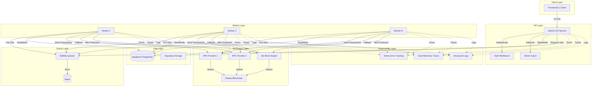

---

## Component Architecture

### API Service Architecture

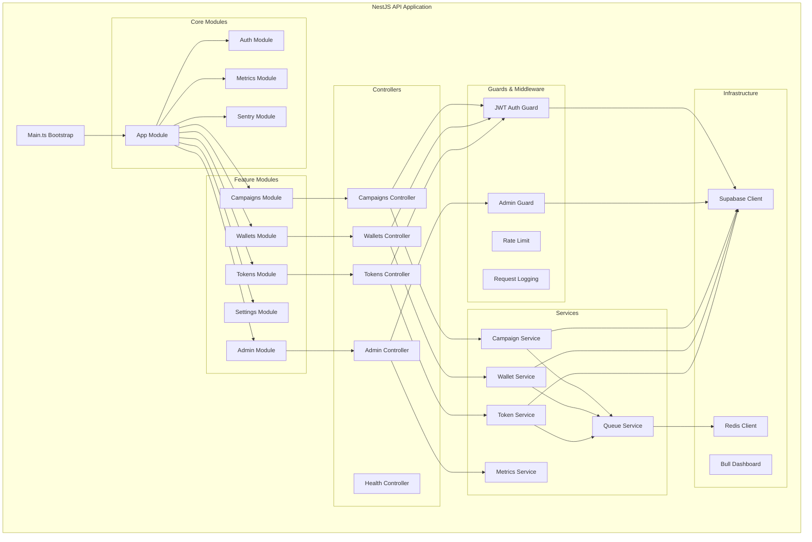

### Worker Service Architecture

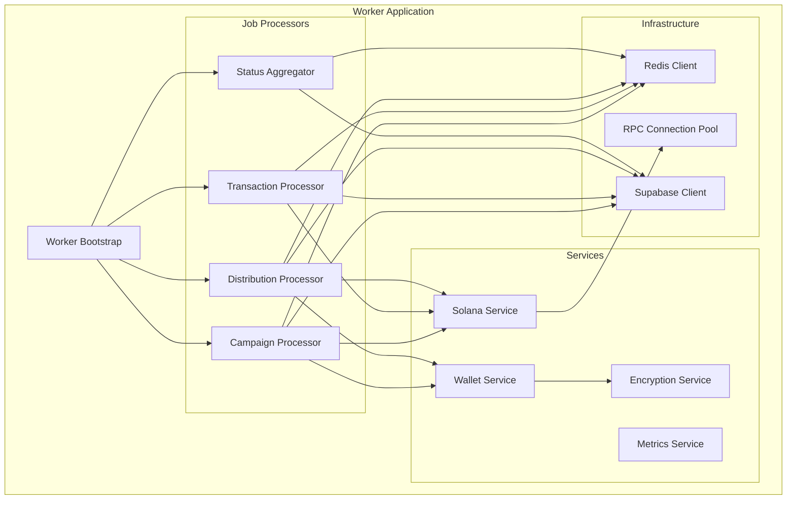

---

## Data Flow Diagrams

### Campaign Creation Flow

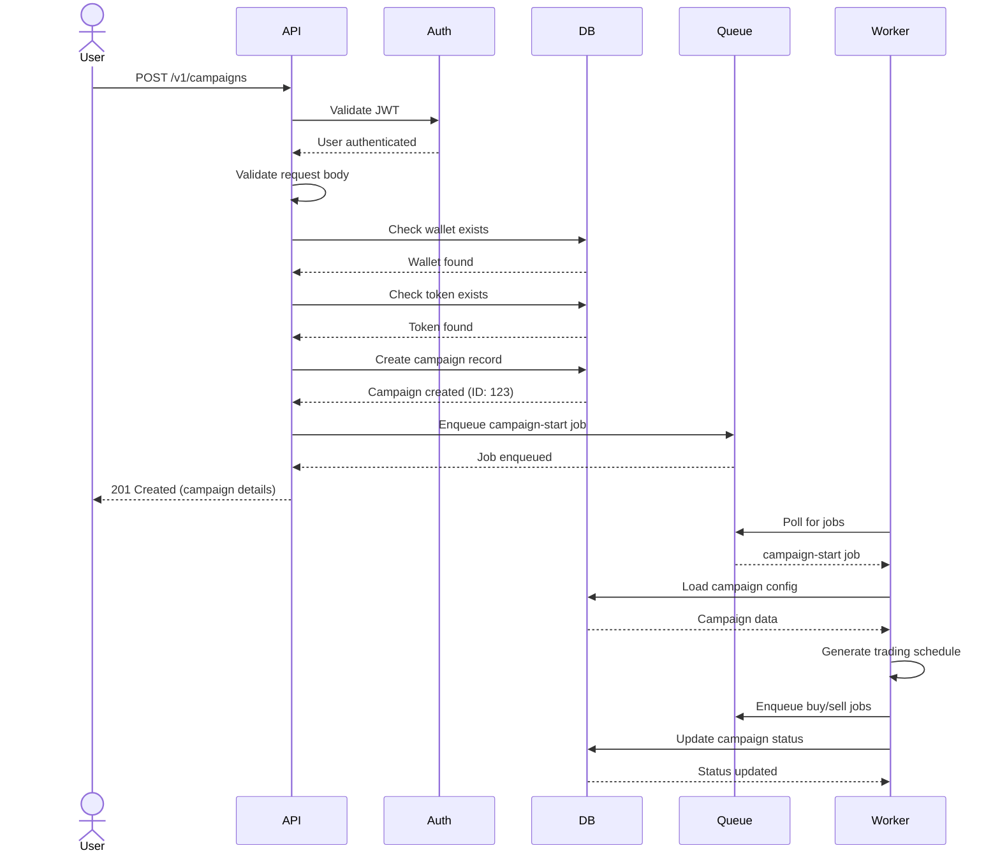

### Transaction Execution Flow

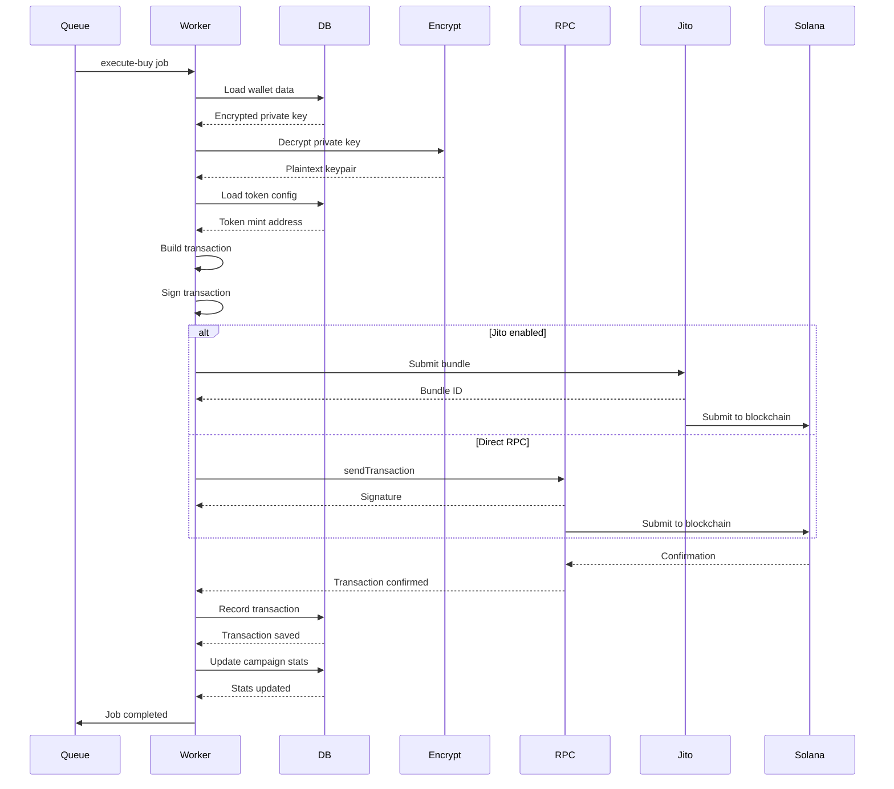

### Wallet Distribution Flow

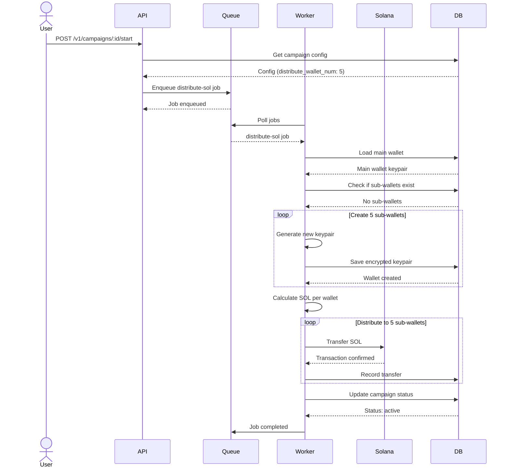

### Real-Time Metrics Flow

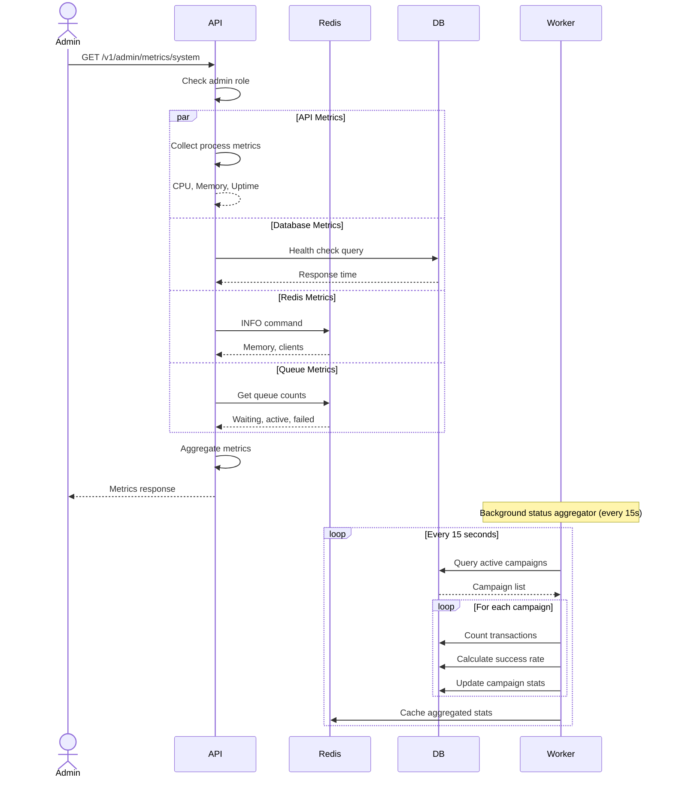

---

## Database Schema

### Entity Relationship Diagram

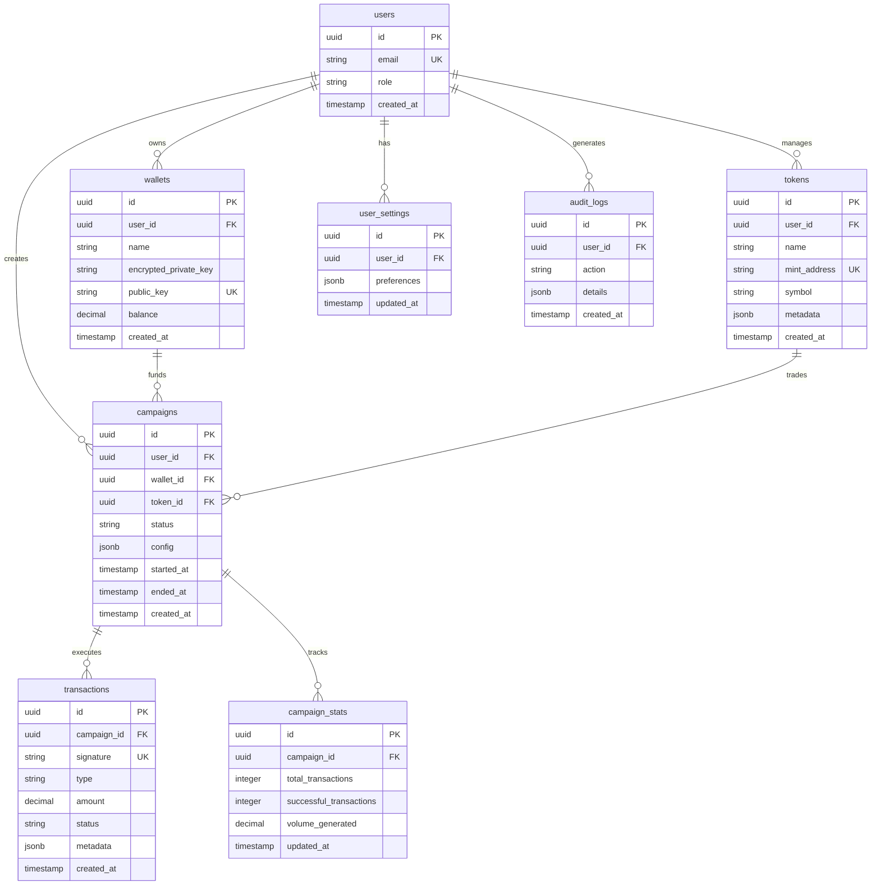

### Key Tables

#### campaigns
```sql
CREATE TABLE campaigns (
    id UUID PRIMARY KEY DEFAULT uuid_generate_v4(),
    user_id UUID NOT NULL REFERENCES users(id),
    wallet_id UUID NOT NULL REFERENCES wallets(id),
    token_id UUID NOT NULL REFERENCES tokens(id),
    name VARCHAR(255) NOT NULL,
    status VARCHAR(50) NOT NULL DEFAULT 'pending',
    config JSONB NOT NULL,
    started_at TIMESTAMP,
    ended_at TIMESTAMP,
    created_at TIMESTAMP DEFAULT NOW(),
    updated_at TIMESTAMP DEFAULT NOW()
);

-- Indexes
CREATE INDEX idx_campaigns_user_id ON campaigns(user_id);
CREATE INDEX idx_campaigns_status ON campaigns(status);
CREATE INDEX idx_campaigns_started_at ON campaigns(started_at);
```

#### transactions
```sql
CREATE TABLE transactions (
    id UUID PRIMARY KEY DEFAULT uuid_generate_v4(),
    campaign_id UUID NOT NULL REFERENCES campaigns(id) ON DELETE CASCADE,
    signature VARCHAR(255) UNIQUE NOT NULL,
    type VARCHAR(50) NOT NULL,
    amount DECIMAL(20, 9) NOT NULL,
    status VARCHAR(50) NOT NULL DEFAULT 'pending',
    metadata JSONB,
    confirmed_at TIMESTAMP,
    created_at TIMESTAMP DEFAULT NOW()
);

-- Indexes
CREATE INDEX idx_transactions_campaign_id ON transactions(campaign_id);
CREATE INDEX idx_transactions_signature ON transactions(signature);
CREATE INDEX idx_transactions_status ON transactions(status);
CREATE INDEX idx_transactions_created_at ON transactions(created_at);
```

---

## Queue Architecture

### BullMQ Queue Structure

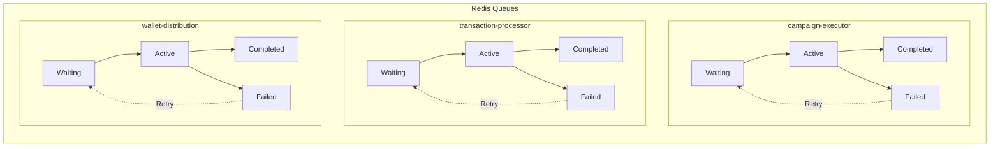

### Queue Configuration

**Queue: campaign-executor**
- **Purpose**: Orchestrate campaign execution
- **Concurrency**: 5 per worker
- **Priority**: High
- **Retry Strategy**: 3 attempts with exponential backoff
- **Job Timeout**: 5 minutes

**Queue: transaction-processor**
- **Purpose**: Execute buy/sell transactions
- **Concurrency**: 10 per worker
- **Priority**: Normal
- **Retry Strategy**: 5 attempts with exponential backoff
- **Job Timeout**: 2 minutes

**Queue: wallet-distribution**
- **Purpose**: Distribute SOL to sub-wallets
- **Concurrency**: 3 per worker
- **Priority**: High
- **Retry Strategy**: 3 attempts
- **Job Timeout**: 10 minutes

### Job Priority System

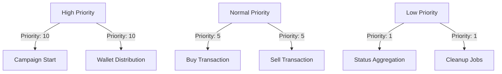

---

## Security Architecture

### Authentication & Authorization Flow

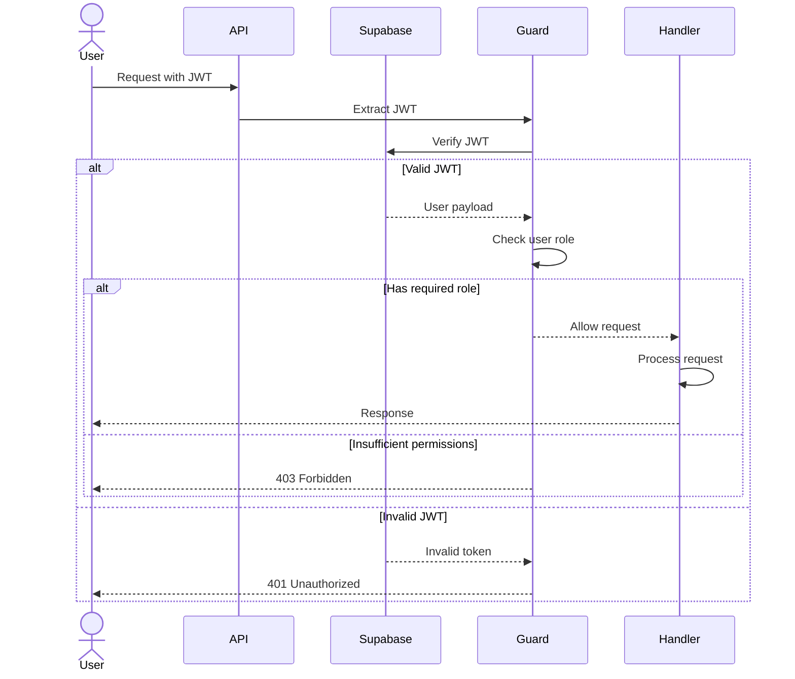

### Encryption Architecture

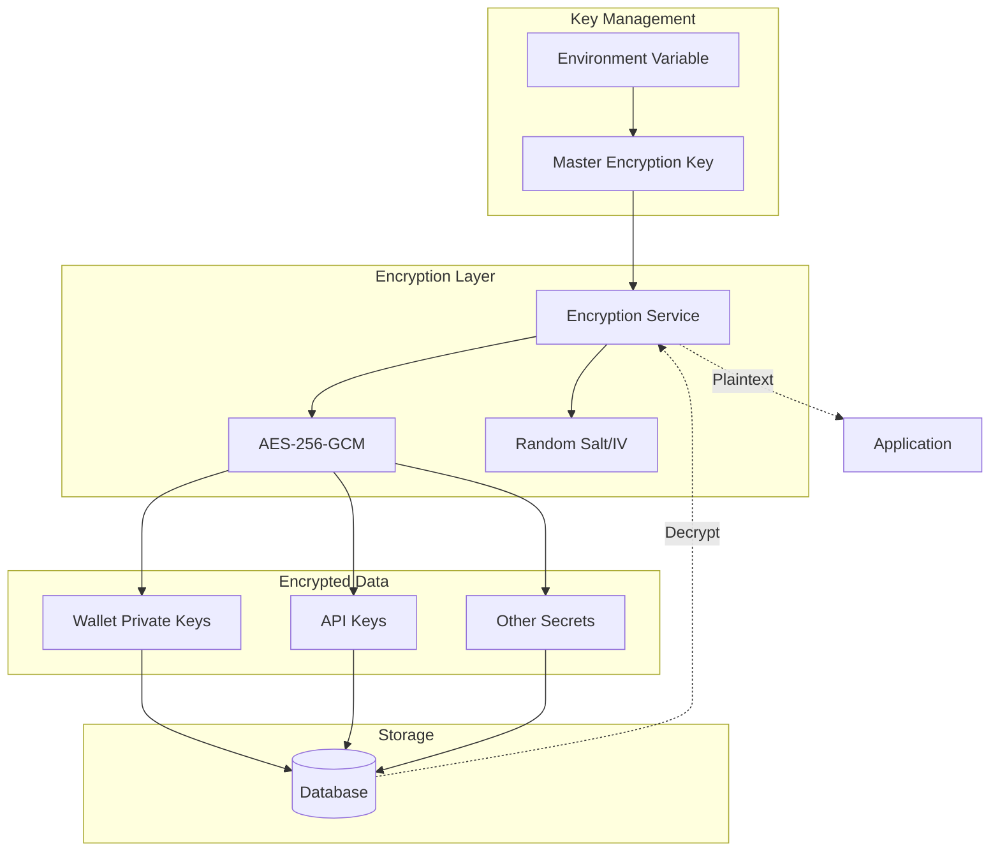

**Encryption Details:**
- **Algorithm**: AES-256-GCM
- **Key Derivation**: PBKDF2
- **Salt/IV**: Random, unique per encryption
- **Master Key**: 32+ bytes, base64-encoded
- **Storage**: Encrypted data stored in database

### Network Security

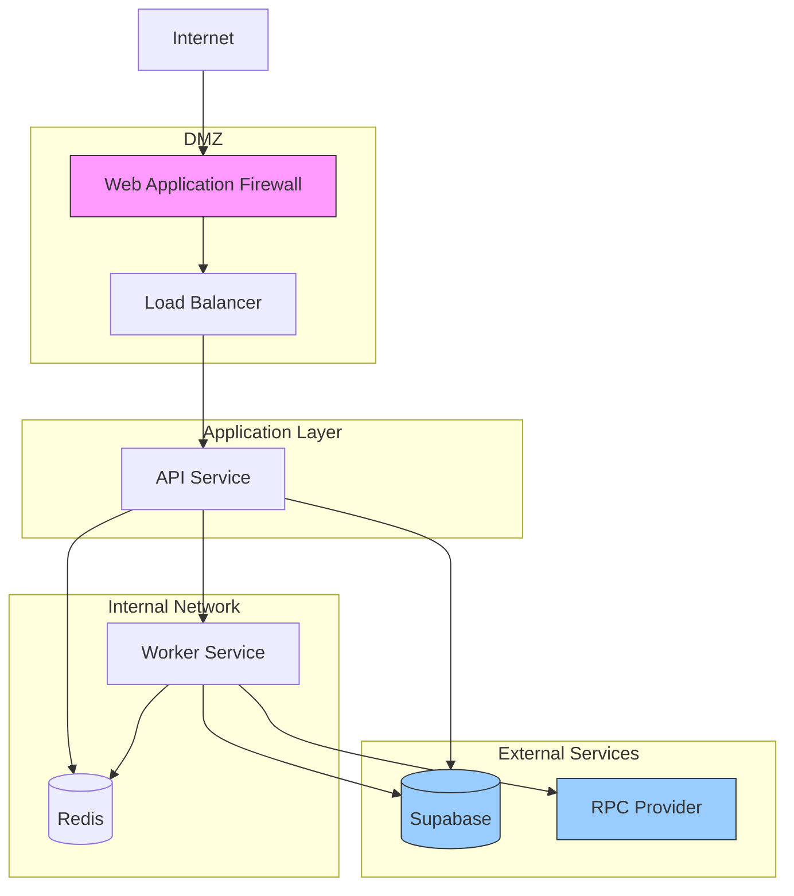

---

## Deployment Architecture

### Docker Compose Deployment

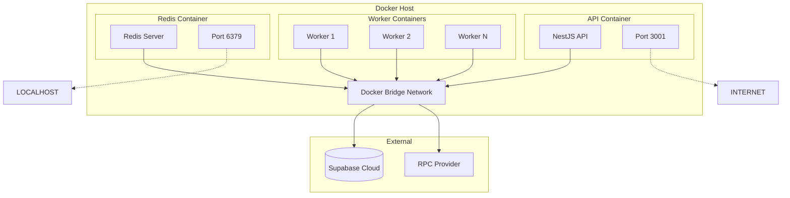

### Kubernetes Deployment

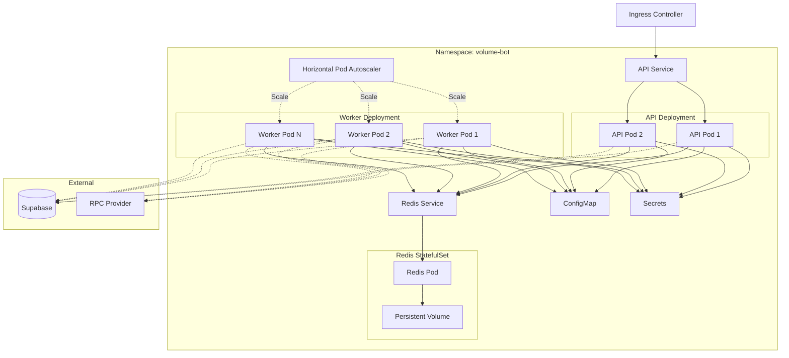

### Multi-Region Deployment (Advanced)

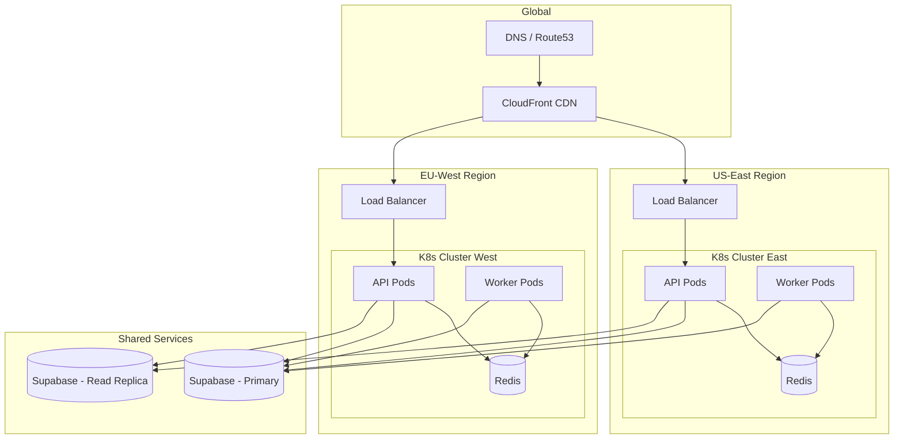

---

## Design Decisions

### Why BullMQ for Job Queues?

**Rationale:**
- Built on Redis (already in stack)
- Superior features over Bull:
  - Better TypeScript support
  - Improved retry mechanisms
  - Built-in rate limiting
  - Priority queues
  - Better performance
- Active maintenance
- Excellent documentation

**Alternatives Considered:**
- Agenda (MongoDB-based)
- Bee-Queue (simpler but less features)
- AWS SQS (vendor lock-in, additional cost)

### Why Supabase for Database?

**Rationale:**
- PostgreSQL (proven, reliable)
- Built-in authentication
- Real-time subscriptions
- Row Level Security (RLS)
- Generous free tier
- Easy scaling path
- Managed backups

**Alternatives Considered:**
- Self-hosted PostgreSQL (more operational overhead)
- PlanetScale (MySQL, different ecosystem)
- MongoDB (not ideal for relational data)

### Why NestJS for API?

**Rationale:**
- Enterprise-grade TypeScript framework
- Excellent dependency injection
- Built-in Swagger integration
- Strong community
- Opinionated structure (good for teams)
- Extensive middleware ecosystem

**Alternatives Considered:**
- Express.js (too minimal, less structure)
- Fastify (faster but smaller ecosystem)
- Hono (newer, less mature)

### Why OpenTelemetry?

**Rationale:**
- Vendor-neutral standard
- Single instrumentation for multiple backends
- Future-proof (industry standard)
- Comprehensive auto-instrumentation
- Active CNCF project

**Alternatives Considered:**
- Datadog APM (vendor lock-in)
- New Relic (expensive at scale)
- AWS X-Ray (AWS-specific)

---

## Scalability Considerations

### Horizontal Scaling

**API Service:**
- Stateless design
- Can scale to N replicas
- Load balanced via Ingress/ALB
- No shared state (uses Redis for sessions)

**Worker Service:**
- Horizontally scalable
- Each worker polls from shared queue
- Auto-scaling based on queue depth
- Recommended: 1 worker per 100 active campaigns

**Redis:**
- Single master for simplicity
- Can add read replicas for metrics
- Redis Cluster for extreme scale
- Consider managed Redis (ElastiCache, Redis Cloud)

### Vertical Scaling

**When to scale vertically:**
- API: High CPU during request processing
- Worker: High memory during transaction building
- Redis: High memory usage from queue depth

**Resource Recommendations:**

| Component | Min | Recommended | High Load |
|-----------|-----|-------------|-----------|
| API       | 512MB / 0.5 CPU | 1GB / 1 CPU | 2GB / 2 CPU |
| Worker    | 512MB / 0.5 CPU | 1GB / 1 CPU | 2GB / 2 CPU |
| Redis     | 512MB | 2GB | 8GB |

### Performance Optimization

**Database:**
- Connection pooling (PgBouncer)
- Appropriate indexes
- Query optimization
- Materialized views for stats

**Redis:**
- Connection pooling
- Pipeline commands
- Use appropriate data structures
- Set TTL on cached data

**RPC Providers:**
- Connection pooling
- Request batching where possible
- Fallback to multiple providers
- Monitor rate limits

---

## Disaster Recovery

### Backup Strategy

**Database (Supabase):**
- Automatic daily backups (Supabase managed)
- Point-in-time recovery available
- Test restore quarterly

**Redis:**
- RDB snapshots (if persistence enabled)
- AOF (Append-Only File) for durability
- Regular backups via `BGSAVE`

**Configuration:**
- Store in version control (Git)
- Secret management via Vault/Secrets Manager
- Document all environment variables

### Recovery Procedures

**Database Failure:**
1. Verify Supabase status
2. Check for scheduled maintenance
3. If outage, wait for Supabase recovery
4. If corruption, restore from backup
5. Validate data integrity post-restore

**Redis Failure:**
1. Check Redis logs
2. Restart Redis service
3. If data loss, jobs will be retried by workers
4. Monitor queue recovery
5. Consider replaying failed jobs

**Complete System Failure:**
1. Restore infrastructure (K8s/Docker)
2. Deploy latest version
3. Restore database from backup
4. Verify all services healthy
5. Resume campaigns gradually

---

## Additional Resources

- [Deployment Guide](./DEPLOYMENT.md)
- [Environment Setup Guide](./ENVIRONMENT_SETUP.md)
- [Monitoring and Runbook Guide](./MONITORING_AND_RUNBOOK.md)
- [API Documentation](http://localhost:3001/api-docs)

---

**Last Updated:** 2025-10-14
